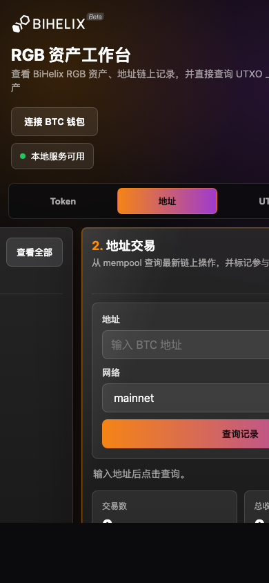

# BTC Address Activity Viewer

一个带本地 server 和静态前端的 BTC 地址链上操作记录查看器，同时保留 Kuikly/KMP RGB 页面源码。

## DApp 使用说明

本 DApp 用于查询任意 BTC 地址的链上交易记录，并查看 UTXO 上关联的 RGB 资产信息。

为了避免对 mempool 服务产生过于频繁的请求，查询 BTC 交易记录前需要先连接 BTC 钱包。连接钱包后，用户可以输入任意 BTC 地址进行查询，查看该地址的收入、支出、手续费、确认状态以及相关 UTXO。

对于某个 UTXO，如果服务端能够解析到 RGB 资产信息，用户可以进一步查看该 UTXO 上的 RGB 资产详情。

未公开的 UTXO 默认不可被任何人直接查看 RGB 资产信息。只有该 UTXO 所属地址的钱包持有人，才可以通过钱包签名证明所有权，并选择将该 UTXO 公开。公开后，其他用户即可直接查看该 UTXO 上的 RGB 资产信息。

签名仅用于证明地址控制权，不会发起链上交易，也不会转移任何资产。



## 本地 Server 与前端

参考 `jp` 的本地服务形态，根目录提供一个 Rust/axum server：

```bash
cargo run
```

默认监听：

```text
http://127.0.0.1:8092
```

可用环境变量修改监听地址：

```bash
RGB_VIEWER_ADDR=0.0.0.0:8092 cargo run
```

server 启动时会拉取一次 token-list 并缓存在内存里，默认来源：

```text
https://node.bihelix.io/v3/asset/list
```

可用环境变量切换来源：

```bash
TOKEN_LIST_BASE_URL=https://your-token-list-host cargo run
```

接口：

```text
GET /api/health
GET /api/mempool/address?address=<btc-address>&network=testnet4
GET /api/utxo/assets?utxo=<txid:vout>
GET /api/tokens
GET /api/tokens/<contract_id>
GET /api/rgb/assets?address=<address>&base_url=https://node-testnet.bihelix.io
```

前端文件在 `static/index.html`，server 会直接托管根路径 `/`。首页分三块：

1. RGB token-list：展示启动时缓存的全部 token，点击进入独立详情页。
2. 地址交易查询：输入 BTC 地址后，从 mempool.space 拉取最新链上交易，按时间倒排展示收入、支出、净变化、手续费、确认状态和参与 UTXO。
3. UTXO RGB 查询：直接输入 `txid:vout`，查询该 UTXO 上的 RGB 资产。

Token 页面：

```text
GET /tokens
GET /token/<contract_id>
```

UTXO 详情会用启动时缓存的 token-list 给 RGB 资产补充 ticker、名称、图标、描述、精度和合约详情。

页面右上角提供“连接 BTC 钱包”，当前支持 BitPocket、Wizz 和 OKX。连接成功后会自动把钱包地址填入地址输入框并查询链上记录。在钱包内置 DApp 浏览器打开时，页面会检测注入的 provider 并自动尝试连接一次。

## Kuikly 页面

`shared/` 下是独立的 Kuikly/KMP RGB 资产查看器页面。页面允许输入 BiHelix 钱包服务地址和 BTC/RGB 地址，并请求：

```text
GET {baseUrl}/v3/asset?address={address}
```

默认服务地址为 `https://node-testnet.bihelix.io`，响应结构兼容现有 `ln-transfer` 中的 Layer1 RGB 资产接口：

```json
{
  "txid": [
    {
      "contract_id": "rgb:...",
      "ticker": "RNA",
      "rgb_amount": 100000000,
      "address": "bc1...",
      "status": "Confirmed",
      "decimal": 8,
      "txid": "..."
    }
  ]
}
```

页面入口为：

```text
RgbAssetViewerPage
```

## 构建

本机需要 JDK 17、Android SDK，以及 Gradle 或项目 Gradle Wrapper。常用命令：

```bash
gradle :shared:compileDebugKotlinAndroid
```

如果接入已有 Kuikly 宿主工程，可以直接复制 `shared/src/commonMain/kotlin/io/bihelix/rgbviewer` 下的页面和查询逻辑，并在宿主路由中打开 `RgbAssetViewerPage`。
